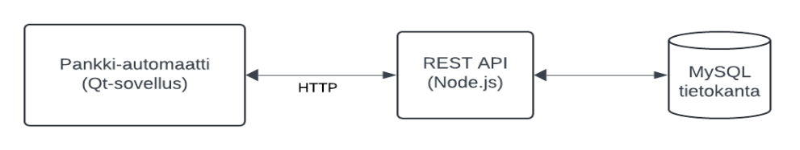

# Ohjelmistokehityksen sovellusprojekti (monimuoto ryhmät)

- Opiskelijoiden tehtävä on suunnitella ja toteuttaa pankkiautomaattijärjestelmä: [**Yleisohje ja arviointi**](#pr_ohje)

- 4 opiskelijan ryhmät määritellään [Excel-dokumentissa](<https://unioulu-my.sharepoint.com/:x:/g/personal/tk_oamk_fi/ETmu1ZUhPdpLuY_QVFEC5gkBYR6tp3Ftdc4HKKpviBAkoA?e=dDAaA4>)

### Oikopolut eri viikoille

- [Viikko 1](./#viikko-1)
- [Viikko 2](./#viikko-2)
- [Viikko 3](./#viikko-3)
- [Viikko 4](./#viikko-4)
- [Viikko 5](./#viikko-5)
- [Viikko 6](./#viikko-6)
- [Viikko 7](./#viikko-7)
- [Viikko 8](./#viikko-8)

### Ohjaajien kommentteja ja vinkkejä

- Tänne on kasattu aikaisempien projektien [ohjaajien kommentteja ja vinkkejä](./dl/kommentit.md)

### Projektista

- Minimikomponentit:
  - Tietokanta (MySQL)
  - Node.js-rajapinta (API) MySQL-tietokantaan
  - Käyttöliittymä (Qt-työpöytäsovellus C++:lla)
- 4 hengen ryhmät
- Versionhallinta (Git + Github)
- Projektidokumentti
- Tekninen määrittelydokumentti
- Readme.md Github-repositorylle
- MS Teams viestintään
- Viikkopalaverit
- Loppuesitykset videona ja englanninkielinen posteri

Avainsanoja: UML/määrittelyt, Qt, API, MySQL, UI/UX

### Oppimistavoitteet

- Opiskelija tunnistaa ja ymmärtää ohjelmistokehityksen vaihejakomallin perusvaiheet. Hän tietää eri vaiheiden merkitykset, vaihetuotteet ja vaiheiden erot
- Itsenäisen ja ryhmätyöskentelyn avulla opiskelija oppii suunnittelemaan ja toteuttamaan vaatimusmäärittelyn mukaisen järjestelmän käyttäen moderneja kehitystyökaluja
- Opiskelija ymmärtää ryhmätyöskentelyn merkityksen ohjelmistokehitystyössä
- Opiskelija osaa käyttää oliopohjaista mallinnuskieltä kehitystyön (UML) eri vaiheissa ja osaa kirjoittaa kaavioiden pohjalta ohjelmakoodia
- Opiskelija osaa suunnitella ja toteuttaa oliopohjaisen sovelluksen luokkakirjaston mukaisesti
- Opiskelija osaa suunnitella ja toteuttaa sovellukseen tietokanta-arkkitehtuurin
- Opiskelija osaa laatia ohjelmistoprojektin dokumentaation ja pystyy viestimään suullisesti ja kirjallisesti, myös englanniksi

### Arviointi

Arviointi perustuu:

- Aikataulussa pysyminen. Työtä pitää tehdä järjestelmällisesti. Viikkoraportointi vaaditaan!
- Ryhmän tuottaman sovellukseen tasoon
- Loppuesitykseen
- Ohjaajan arvioon (tämä perustuu palavereissa saatuihin kokemuksiin ja GitHubin näkymiin)
- Toveriarvioon, joka tehdään web-sovelluksella (vertaisarviointi)
- Itsearvioon, joka tehdään web-sovelluksella (itsearviointi)
- Projektidokumentointi ja tekninen määrittelydokumentti (heikko dokumentointi voi alentaa arvosanaa)
- Englanninkielinen posteri (hyväksytty/hylätty, pitää päästä läpi)
- Arvosanaa ei voi korottaa myöhemmin

Lisätehtäviä parempaan arvosanaan:

- Arvosanaan 5 vaaditaan lisäominaisuuksia (arvosanaa korottavat lisätehtävät on määritelty tarkemmin kohdassa "Yleisohje ja arviointi"). Katso [**Yleisohje ja arviointi**](#pr_ohje)

Extratehtäviä (erityisesti monimuoto-opiskelijat, joilla on jo Linux-kurssi käytynä). Nämä eivät korota arvosanaa:

- API laitetaan reverse proxyn taakse. Esimerkiksi [Apache](https://httpd.apache.org/), [Nginx](https://nginx.org), [Caddy](https://caddyserver.com/) tai [frp](https://github.com/fatedier/frp)
- Koko backend VPS-linuxilla (pilvipalvelusta kuten Digital Ocean tms. se VPS) tai jossain PaaS-alustassa suoraan tai konttina (Render.com, Fly.io, Vercel tms)
- Web-palvelin käännettyjen softien lataamiseen (releaset automaattisesti tänne?)

### Qt/Express-materiaalit (Pekka Alaluukas)

- Pekka Alaluukkaan [ohjeet ja tallenteet videosoittolistana](https://www.youtube.com/playlist?list=PLWl0bS7jZq99iOUNmMyuT9EgU6YfxP_en)
- Git perusteita [Peatutor.com/git_tutor/](https://peatutor.com/git_tutor/)
- Muita Pekan tekemiä ohjeita (Qt yms.): [Peatutor.com/](https://peatutor.com/)

### Ohjelmistokehityksen perusteet ja UML-mallinnus videot Yujassa (Teemu Leppänen)

- Teemu Leppäsen luentotallenteet [videosoittolista \(kevät 2025\)](https://oulu.cloud.panopto.eu/Panopto/Pages/Sessions/List.aspx#folderID=%2221064f4a-0801-451c-8e5c-b29d00e337be%22)
- Teemu Leppäsen wanhat luentotallenteet [videosoittolista \(kevät 2024\)](https://oulu.yuja.com/V/PlayList?node=3375576&a=1408679542)
- Teamsissa [oppimateriaalit-kanava](<https://unioulu.sharepoint.com/:f:/r/sites/Ohjelmistokehityksensovellusprojektitestialusta/Shared%20Documents/3.%20Tiedostot%20ja%20yleiset%20oppimateriaalit?csf=1&web=1&e=hbYrc3>)

### Extraa: IaC, reverse proxy, ohjelmistiolisensseistä (Teemu Korpela)

- [13.1.2025 Teemaluento: IaC, CI/CD, Reverse proxy](https://www.youtube.com/live/1Iiflc1Rj7o)
- [20.1.2025 Teemaluento: Palveluiden bind ja projektien markdownista](https://www.youtube.com/live/Le6hPRxJn9g)
- [21.4.2021 Teemaluento: Vähän ohjelmistolisensseistä](https://www.youtube.com/watch?v=57m6hktjfeg&t=225s)

### Kaaviot dokumentointiin

Esimerkiksi näillä työkaluilla:

- Drawio: [https://www.drawio.com/](https://www.drawio.com/). Suora linkki: [https://app.diagrams.net/](https://app.diagrams.net/)
- Lucidchart: [https://www.lucidchart.com](https://www.lucidchart.com)
- Diagrameditor: [https://www.diagrameditor.com/](https://www.diagrameditor.com/)
- PlantUML: [https://plantuml.com/](https://plantuml.com/)

Katso näistä Teams-kanavan dokumenteista mallia teknisen määrittelydokumentin kaavioihin:

- Ohjelmistokehityksen [materiaalit](<https://unioulu.sharepoint.com/:f:/r/sites/Ohjelmistokehityksensovellusprojektitestialusta/Shared%20Documents/3.%20Tiedostot%20ja%20yleiset%20oppimateriaalit/Ohjelmistokehityksen%20materiaalit?csf=1&web=1&e=T5e6e4>)
- Valmiita esimerkkejä [määrittelyvaiheen kaavioista](<https://unioulu.sharepoint.com/:b:/r/sites/Ohjelmistokehityksensovellusprojektitestialusta/Shared%20Documents/3.%20Tiedostot%20ja%20yleiset%20oppimateriaalit/Ohjelmistokehityksen%20materiaalit/IN00CS90_Luku_5_Maarittelyvaihe.pdf?csf=1&web=1&e=TnPtge>)
- UML-mallinnuksen [kaavioesimerkit](<https://unioulu.sharepoint.com/:f:/r/sites/Ohjelmistokehityksensovellusprojektitestialusta/Shared%20Documents/3.%20Tiedostot%20ja%20yleiset%20oppimateriaalit/Ohjelmistokehityksen%20materiaalit/UML-mallinnus?csf=1&web=1&e=0UrXUt>)
- Yleinen [esimerkkikuva järjestelmäarkkitehtuurista](./dl/arkkitehtuurikuva.png)

### Softalisensseistä

- Choose a license: [https://choosealicense.com/](https://choosealicense.com/)
- Public license selector:  [https://ufal.github.io/public-license-selector/](https://ufal.github.io/public-license-selector/)

## Noin 15 min viikkopalavereiden yleinen agenda

Viikkopalaverit pidetään ryhmän alikanavalla MS Teamssilla, niin ei tarvitse tehdä erillisiä kutsuja vaan voi liittyä suoraan siellä.

- Pääsääntöisesti kaikkien pitää olla paikalla
- Yleistä keskustelua, että miten projekti on edennyt
- Yleistä keskustelua, että miten kukin opiskelija on osallistunut
- Versiohallinnan esittely (ja .gitignore käytössä)
- Muutoksia arvosanatavoitteeseen tai tavoitteisiin ylipäätänsä
- Vilkaistaan projektidokumenttia ja teknistä määrittelyä

  
# Viikko 1

- Aloitusinfo
- Luodaan ja numeroidaan neljän opiskelijan ryhmät
- Jokainen opiskelija luo tunnuksen itselleen sivustolla
  [https://peatutor.com/project_app/register/tvt25kmo](https://peatutor.com/project_app/register/tvt25kmo).
  (Luotuasi tunnuksen, saat sähköpostin, jossa on tunnuksesi ja salasanasi. Pidä ne tallessa.)
- Tutustukaa arviointikriteereihin ja päättäkää mihin arvosanaan pyritään
- Tarkista että olet kurssin Teams-kanavalla (pyydä opettajalta pääsy jos et ole). Käytä students.oamk.fi-sähköpostiosoitetta kun kirjaudut Teamssiin
- Jokaisesta ryhmästä yksi luo kurssin Teams-kanavan **ALAISUUTEEN** (ei siis kokonaan uutta Teams-kanavaa) uuden YKSITYISEN alikanavan nimeltä:
  - Ryhmä-xx ryhmä 1:n kanava on nimeltään Ryhmä-01 ryhmä 2:n kanava on nimeltään on Ryhmä-02, jne. Katso [tästä kuvasta yleinen  nimeämismalli](./dl/teams_ryhmat.png)
- Kun ryhmän yksityinen Teams-kanava on luotu, lisää kanavalle ryhmän muut jäsenet. Lisää myös ohjaavat opettajat kanavan omistajaksi: Teemu Korpela ja Pekka Alaluukas
- Github käyttöön (Pekan tekemän organisaation alle): [Pekan ohje](<https://unioulu.sharepoint.com/:b:/s/Ohjelmistokehityksensovellusprojektitestialusta/EZ_-C1pCL_dIsQ-WMkYrdE8BfpxDQDi9hyp2sYgYqDW-HA?e=4VrQ8A>)
- Ryhmän jäsenet sopii alustavasti kuka tekee mitäkin toiminnallisuuksia (mutta ei niin, että vain yksi tekee koko Qt-työpöytäsovelluksen, että vain yksi tekee koko tietokannan jne.)
- Aloittakaa tekemään projektidokumenttia (pitää tehdä yhdessä). Pohja löytyy Teamsista. Tallentakaa oma versio ryhmän github-repositoryyn documents-hakemistoon.
- Aloittakaa tekemään teknistä määrittelydokumenttia (pitää tehdä yhdessä). Pohja löytyy Teamsista. Tallentakaa oma versio ryhmän github-repositoryyn documents-hakemistoon. 
- Katsokaa yhdessä valmiiksi viikon 2+ tavoitteet
- Viikon luennot:
  - Aloitusinfo kurssin tekemiseksi
  - Asiaa Qt:stä, MySQL:stä ja C++:sta
  - Ohjelmistotuotanto ja UML-mallinnus osa 1: Järjestelmäarkkitehtuuri, Käyttötapaukset, Tietosisältö
- Tämän viikon aikana pitää olla tehtynä:
  - Projektisuunnitelma alulle
  - Tekninen määrittely-dokumentti alulle
  - Github repository käyttöön
  - Yksityinen Teams-kanava luotu kurssin Teams-kanavan alle. Ryhmän jäsenet ja opettajat lisätty privaattikanavan omistajiksi
  - Priorisoikaa backend (tietokanta ja API), jotta käyttöliittymän voi tehdä toimimaan suoraan sitä vasten
  - Tietokannan ER-kaavio pitää olla ohjeiden mukaisesti tehtynä ja ohjaajan (Pekka) hyväksymä. **Kevät 2025: ER-kaavio viedään GitHubiin docs-kansioon**
  - Tietokannan, rajapinnan ja käyttöliittymän suunnittelua ja tekemistä
  - Qt-sovellus alulle

Täysin extraa, ei vaikuta arviointiin: **Huom! tvt24spl ja tvt24spo: ei tarvitse Kanbania**

- Githubissa Kanban käyttöön ja Kanban-taulu linkitettynä ryhmän oman Teams-alikanavan omaksi välilehdeksi
  - Käytä Githubin Kanban-työkalun valmista sarakemuotoista pohjaa ja lisää / editoi siihen sarakkeet:
    - Kanbanissa pitää olla vähintään nämä sarakkeet tai ainakin mukaillen: Requested/backlog, Design/analysis, Development, Review/testing, Deployment, Done
  - Esimerkkejä Kanban-tauluista: [https://businessmap.io/kanban-resources/kanban-software/kanban-board-examples](https://businessmap.io/kanban-resources/kanban-software/kanban-board-examples)
- Pilkkokaa tekemisiä ja toiminnallisuuksia Kanban-tauluun (ja muistakaa lisätä/päivittää taulua jatkuvasti)

# Viikko 2

- Viikkopalaveri opettajan kanssa
  - Esitelkää mitä dokumentteihin (projektisuunnitelma, tekninen määrittely) on kirjattu tähän mennessä
- Luento:
  - Projektin suunnitteluvaihe ja UML-mallinnus osa 2: Komponenttikaavio, tilakaavio
  - Lisämateriaali: luentotallenne (13.1.2025) Youtubessa: [Teemaluento: IaC, CI/CD, Reverse proxy](https://www.youtube.com/live/1Iiflc1Rj7o)
- Sovelluksen tekemistä
- Tämän viikon aikana pitää olla tehtynä:
  - Ohjelmistokehityksen perusteet ja UML-mallinnus videot katsottuna: [Soittolista luentotallenteista](https://www.youtube.com/playlist?list=PLWl0bS7jZq99iOUNmMyuT9EgU6YfxP_en)
  - Projektisuunnitelma valmis.
  - Tekninen määrittely osin tehtynä: Järjestelmäarkkitehtuuri, Käyttötapaukset, Tietosisältö 
  - CRUD-operaatioista demo

# Viikko 3

- Viikkopalaveri
  - Projektisuunnitelma kokonaan valmis
  - Tekninen määrittely: Järjestelmäarkkitehtuuri, Käyttötapaukset, Tietosisältö valmiina
  - Esitellään dokumentit
  - Versiohallinnan esittely
- Luento:
  - (Extraoppimista) Ohjelmistolisensseistä: [Luentotallenne Youtubessa vuodelta 2021](https://youtu.be/57m6hktjfeg?t=225)
    - Videolla käytetyt luentokalvot [täällä](./dl/softwarelicensing.pdf)
  - Opiskelijaprojektien portfoliosta Githubiin, Markdown-kieli ja readme.md-tiedostosta projektille
  - Luentotallenne (20.1.2025) Youtubessa: [Teemaluento: Palveluiden bind ja projektien markdownista](https://youtube.com/live/Le6hPRxJn9g)
- Kirjoita Github-projektille kuvaus markdownilla (readme.md-tiedosto). Github osaa prosessoida markdown-kieltä suoraan readme.md:stä HTML:ksi
  - Muista päivittää omaa projektikuvausta Githubissa (readme.md) myös myöhemmin!
  - Esimerkkejä [hyvistä readme-projektitiedostoista](https://github.com/matiassingers/awesome-readme)
  - Teemun tekemä yksinkertainen esimerkki: [https://github.com/t2946282/demoproject](https://github.com/t2946282/demoproject)
- Sovelluksen tekemistä
- Tämän viikon aikana pitää olla tehtynä:
  - Readme.md:n ensimmäinen versio repositorylle Githubissa
  - Sovelluksen tekemistä
  - [Postmanilla](https://www.postman.com/) API:n testaus jos API jo tehtynä

# Viikko 4

- Viikkopalaveri
  - Versiohallinnan esittely
- Katso hetki joitakin [livenä koodaavia striimaajia Twitchistä](https://www.twitch.tv/directory/game/Software%20and%20Game%20Development) ja koita selvittää:
  - Mikä/mitkä kielet käytössä? Jotain tiettyjä frameworkeja?
  - Mikä IDE/editori?
  - Näkyykö videolla jokin versionhallinta, projektityökalu jne. käytössä?
- Sovelluksen tekemistä
- Teknisen määrittelydokumentin tekemistä
- Tämän viikon aikana pitää olla tehtynä:
  - Twitch-striimien vilkaisu
  - Tekninen määrittelydokumentti eteenpäin
  - Sovelluksen tekemistä

# Viikko 5

- Viikkopalaveri
  - Versiohallinnan esittely
- Sovelluksen tekemistä
- Tämän viikon aikana pitää olla tehtynä:
  - Tekninen määrittelydokumentti kokonaan valmiiksi 
  - Sovelluksen tekemistä
 
  
# Viikko 6

- Viikkopalaveri
  - Esitellään valmis tekninen määrittelydokumentti
  - Versiohallinnan esittely
- Sovelluksen tekemistä
- Tämän viikon aikana pitää olla tehtynä:
  - Projektille kirjoitettu markdown-muotoinen Readme-tiedosto Githubiin
  - Sovelluksen tekemistä

# Viikko 7

- Viikkopalaveri
  - Versiohallinnan esittely
- Sovelluksen tekemistä
- Demovideon valmistelu
- Ryhmä tekee yhdessä posterin englanniksi. Posteripohja löytyy Teamssista
- Ota posterista hyvälaatuinen kuvaruutukaappaus, lisää se kuvana Github-repositoryyn ja linkitä näkyväksi readme.md tiedostossa repositoryn etusivulla
- Tämän viikon aikana pitää olla tehtynä:
  - Posteri valmiiksi ja Teamssiin
  - Posteri Githubissa kuvana ja linkitetty readme.md:ssä repositoryn etusivulle
  - Sovelluksen tekemistä

# Viikko 8

- Demovideo projektista:
  - Videon pituuden tulisi olla noin 5 minuuttia, missä ehtii yleensä näyttämään keskeiset osat applikaatiosta ja posterista.
  - Videon on oltava julkisesti saatavilla ilman kirjautumista
    - YouTubeen unlisted-videoksi (myös students.oamk.fi -tunnukset toimivat myös Youtubeen)
    - Älä aseta videon lupaa "YouTube-sisältö lapsille", koska se ei salli videon tallentamista YouTube-soittolistaan
    - Linkkaa videon URL ryhmän Teams-kanavalle
  - Luo 3-4 sivun PowerPoint- tai PDF-dokumentti tukemaan videon esitystä. Dokumentissa tulisi olla vähintään:
    - Mitkä olivat projektin tavoitteet
    - Ketkä osallistuivat projektiin ja mitä he tekivät (suunnilleen)
    - Mikä oli hyvää, mikä oli huonoa
    - Esitä dokumentin sisältö videon alussa
    - Kaikkien ei välttämättä tarvitse puhua videolla (mutta toki saa)
    - Esittele mahdollinen Kanban
    - Näytä posteri videon lopuksi
    - Lisää PowerPoint- tai PDF-dokumentti Github-repositoryyn
  - Esittele pankkiautomaattiprojekti
- Loppuesitykset koko luokalle (osallistumispakko)
  - Ohjelman demonstrointi ja vapaata keskustelua
  - Posterin esittely
 

# Kirjat ja kurssit taustatiedoksi ja malliksi

Tee tunnus O\'Reillyn verkkokirjastoon students.oamk.fi:n sähköpostilla: [https://libguides.oulu.fi/oreilly](https://libguides.oulu.fi/oreilly) ja valitse institution not listed. Tuo on kaupallinen palvelu, mihin Oamkin kirjasto on ostanut pääsyn. Kannattaa käydä selailemassa tuota online-kirjastoa muutenkin.

Aika tunnettuja ja arvostettuja ohjelmistotekniikan kirjoja. Enemmistö näistä kirjoista suoraan tästä [tweetistä](https://x.com/milan_milanovic/status/1846806122021449992):

- The Pragmatic Programmer: your journey to mastery: [https://learning.oreilly.com/library/view/the-pragmatic-programmer/9780135956977/](https://learning.oreilly.com/library/view/the-pragmatic-programmer/9780135956977/)
- Code Complete: [https://learning.oreilly.com/library/view/code-complete-2nd/0735619670/](https://learning.oreilly.com/library/view/code-complete-2nd/0735619670/)
- Design Patterns: Elements of Reusable Object-Oriented Software: [https://learning.oreilly.com/library/view/design-patterns-elements/0201633612/](https://learning.oreilly.com/library/view/design-patterns-elements/0201633612/)
- Designing Data-Intensive Applications: [https://learning.oreilly.com/library/view/designing-data-intensive-applications/9781491903063/](https://learning.oreilly.com/library/view/designing-data-intensive-applications/9781491903063/)
- Clean Code Fundamentals: [https://learning.oreilly.com/course/clean-code-fundamentals/9780134661742/](https://learning.oreilly.com/course/clean-code-fundamentals/9780134661742/)
- Clean Architecture: A Craftsman's Guide to Software Structure and Design: [https://learning.oreilly.com/library/view/clean-architecture-a/9780134494272/](https://learning.oreilly.com/library/view/clean-architecture-a/9780134494272/)
- Modern Software Engineering: Doing What Works to Build Better Software Faster: [https://learning.oreilly.com/library/view/modern-software-engineering/9780137314942/](https://learning.oreilly.com/library/view/modern-software-engineering/9780137314942/)
- Algorithms: 24-part Lecture Series: [https://learning.oreilly.com/course/algorithms-24-part-lecture/9780134384528/](https://learning.oreilly.com/course/algorithms-24-part-lecture/9780134384528/)
- Fundamentals of Software Architecture: [https://learning.oreilly.com/library/view/fundamentals-of-software/9781492043447/](https://learning.oreilly.com/library/view/fundamentals-of-software/9781492043447/)

Qt-aiheiset (ei tiedoa laadusta):

- Qt 6 C++ GUI Programming Cookbook: [https://learning.oreilly.com/library/view/qt-6-c/9781805122630/](https://learning.oreilly.com/library/view/qt-6-c/9781805122630/)
- Getting Started with Qt 5: [https://learning.oreilly.com/library/view/getting-started-with/9781789956030/](https://learning.oreilly.com/library/view/getting-started-with/9781789956030/)

Node.js (ei tieto laadusta):

- Modern JavaScript from the Beginning: [https://learning.oreilly.com/course/modern-javascript-from/9781805127826/](https://learning.oreilly.com/course/modern-javascript-from/9781805127826/)
- Node.js - The Complete Guide: [https://learning.oreilly.com/course/node-js-the/9781838826864/](https://learning.oreilly.com/course/node-js-the/9781838826864/)
- Node.js Design Patterns: [https://learning.oreilly.com/library/view/node-js-design-patterns/9781839214110/](https://learning.oreilly.com/library/view/node-js-design-patterns/9781839214110/)
- The Complete Node.js Developer Course: [https://learning.oreilly.com/course/the-complete-node-js/9781789955071/](https://learning.oreilly.com/course/the-complete-node-js/9781789955071/)

Linux-aiheiset (ei tieto laadusta):

- How Linux Works, 3rd Edition: [https://learning.oreilly.com/library/view/how-linux-works/9781098128913/](https://learning.oreilly.com/library/view/how-linux-works/9781098128913/)
- Learning Modern Linux: [https://learning.oreilly.com/library/view/learning-modern-linux/9781098108939/](https://learning.oreilly.com/library/view/learning-modern-linux/9781098108939/)
- Efficient Linux at the Command Line: [https://learning.oreilly.com/library/view/efficient-linux-at/9781098113391/](https://learning.oreilly.com/library/view/efficient-linux-at/9781098113391/)

UML (ei tietoa laadusta):

- Learning UML 2.0: [https://learning.oreilly.com/library/view/learning-uml-2-0/0596009828/](https://learning.oreilly.com/library/view/learning-uml-2-0/0596009828/)
- UML Fundamentals: [https://learning.oreilly.com/course/uml-fundamentals/9781771373630/](https://learning.oreilly.com/course/uml-fundamentals/9781771373630/)
- Applying UML and Patterns: An Introduction to Object-Oriented Analysis and Design and Iterative Development: [https://learning.oreilly.com/library/view/applying-uml-and/0131489062/](https://learning.oreilly.com/library/view/applying-uml-and/0131489062/)

API (ei tietoa laadusta):

- Mastering API Architecture: [https://learning.oreilly.com/library/view/mastering-api-architecture/9781492090625/](https://learning.oreilly.com/library/view/mastering-api-architecture/9781492090625/)
- Understanding APIs and RESTful APIs: [https://learning.oreilly.com/course/understanding-apis-and/9781800564121/](https://learning.oreilly.com/course/understanding-apis-and/9781800564121/)

MySQL (ei tietoa laadusta):

- SQL Queries for Mere Mortals: A Hands-On Guide to Data Manipulation in SQL: [https://learning.oreilly.com/library/view/sql-queries-for/9780134858432/](https://learning.oreilly.com/library/view/sql-queries-for/9780134858432/)
- Learning SQL, 3rd Edition: [https://learning.oreilly.com/library/view/learning-sql-3rd/9781492057604/](https://learning.oreilly.com/library/view/learning-sql-3rd/9781492057604/)
- Fundamentals of Data Engineering: [https://learning.oreilly.com/library/view/fundamentals-of-data/9781098108298/](https://learning.oreilly.com/library/view/fundamentals-of-data/9781098108298/)
- MySQL 5: [https://learning.oreilly.com/course/mysql-5/9781926873961/](https://learning.oreilly.com/course/mysql-5/9781926873961/)

___

 
 
# Projektityön kuvaus

Työn aihe on pankkiautomaatti

## Ohjelmiston rakenne on seuraava

### Työ sisältää

- Tietokannan (MySQL/MariaDB)
- REST APIn (Node.js/Express.js)
- Pankkiautomaattisovelluksen (Qt työpöytäsovellus, jossa käytetään Qt Network moduulia)

**Huom!** Edellä mainitut kuuluvat kurssin sisältöön ja arviointi perustuu niiden osaamiseen, joten millään muilla tekniikoilla noita ei saa korvata.

## Sovelluksen toiminta

- Qt-sovellus kommunikoi REST APIn kanssa http-protokollan avulla.
- REST API hoitaa kommunikoinnin tietokannan kanssa.

## ARVIOINTI

Arviointi perustuu tähän dokumenttiin. Mikäli ristiriitaista tietoa esiintyy, niin tämä dokumentti on se, jota noudatetaan.

**Huom!** Monimuotoryhmissä ei käytetä kortinlukijaa, vaan aloitusikkunasta avataan PIN-koodinkyselykäyttöliittymä painiketta painamalla, jossa annetaan PIN-koodin lisäksi kortin-id.

### Vähimmäisvaatimukset sovellukselle (arvosana 1)

- Debit kortti toteutettava (ei luottoa, saldo ei saa mennä miinukselle)
- Qt-sovelluksen aloituskäyttöliittymä
- Kortinlukijan käyttö ja PIN-koodin syöttö
- Oikealla PIN-koodilla avautuu pääkäyttöliittymä, väärällä uudelleenkysely
- Saldo tarkastelu
- Rahan nosto: 20, 40, 50 tai 100 €
- Näytetään 10 viimeisintä tilitapahtumaa

### Vähimmäisvaatimukset (arvosana 2)

- PIN-koodin syöttöraja 10 sekuntia (jos koodia ei anneta 10 sekunnin aikana palataan aloituskäyttöliittymään)
- REST API:in toteutettu kaikkien tietokanta-taulujen CRUD-operaatiot (vaikkei niitä tarvita pankkiautomaatissa)

### Hyvän arvosanan vaatimukset (arvosana 3)

- Kortti voi olla joko debit tai credit
- Credit-kortilla nosto luottorajan puitteissa
- Vapaavalintaisen summan nosto (automaatissa 20 ja 50 € seteleitä)
- 3 väärää PIN-koodia lukitsee kortin (ei vaadita tallennetamista tietokantaan)

### Hyvän arvosanan vaatimukset (arvosana 4)

- Korttilukitus tallennetaan tietokantaan (eli lukitus säilyy vaikka sovellus käynnistetään uudelleen)
- 30 sekunnin inaktiivisuus palauttaa alkutilaan (jos käyttäjä ei tee mitään 30 sekunnin aikana, palataan aloituskäyttöliittymään ja kaikki muut ikkunat suljetaan)
- Tilitapahtumien selaus (eteen/taakse, 10 kerrallaan)

### Kiitettävän arvosanan vaatimukset (arvosana 5)

- Kaksoiskortit (debit + credit samassa kortissa)
- Kirjautuessa valinta: debit vai credit (vain jos kyseessä kaksoiskortti)
- Tilakaavio luotu
- **Lisäominaisuus** sovittava ohjaajan kanssa

(Huom! Kaksoiskortti on kytketty kahteen eri tiliin, joista toinen on debit-tili ja toinen credit-tili)

### Tiivistelmä arvosanoille

|                            | 1  | 2  | 3  | 4  | 5  |
|----------------------------|----|----|----|----|----|
| Debit kortti               | x  | x  | x  | x  | x  |
| Credit kortti              |    |    | x  | x  | x  |
| Kaksoiskortti              |    |    |    |    | x  |
| Kortinlukija toimii        | x  | x  | x  | x  | x  |
| Kirjautuminen PIN-koodilla | x  | x  | x  | x  | x  |
| Saldon näyttö              | x  | x  | x  | x  | x  |
| Rahan nosto (20,40,50,100) | x  | x  | x  | x  | x  |
| Rahan nosto (muu summa)    |    |    | x  | x  | x  |
| Tilitapahtumien näyttö     | x  | x  | x  | x  | x  |
| PIN-koodille 10 s timer    |    | x  | x  | x  | x  |
| Kaikki CRUD-operaatiot     |    | x  | x  | x  | x  |
| PIN-lukitus istunnolle     |    |    | x  | x  | x  |
| PIN-lukitus tietokantaan   |    |    |    | x  | x  |
| 30 s timerit               |    |    |    | x  | x  |
| Tilitapahtumien selaus     |    |    |    | x  | x  |
| Lisäominaisuus             |    |    |    |    | x  |

#### Arvosanaa alentavia seikkoja

- Dokumentoinnin puutteet
- MVC-mallin noudattamatta jättäminen backendissä

## Vaatimukset tietokannalle

### Ilman credit-kortti ominaisuutta

- Useita tilejä asiakkaalla
- Yhdellä tilillä yksi omistaja
- Asiakkaalla voi olla tili ilman korttia
- Useita kortteja asiakkaalla, mutta yksi kortti → yksi tili
- Asiakastiedoissa: etunimi, sukunimi, osoite
- PIN-koodi hashattuna (bcrypt)

### Kun toteutetaan credit-kortti ominaisuus

- Credit-korteilla pitää olla luottoraja (credit-korteille ei tarvita erillistä taulua, jos debit-korteille laitetaan luottorajaksi nolla)

### Kun toteutetaan kaksoiskortti

- Kortilla pääsy useaan tiliin (debit ja credit)

### Lisäominaisuuksia tietokannalle

- Asiakkaalla käyttöoikeus toisen omistajan tilille

## Opiskelijan arviointi

- Sovelluksen arvosana
- Vertais- ja itsearviointi
- Ohjaajien näkemys
- Githubin informaatio

### Arvioinnin kohteet

- Ryhmätyöskentely
- Itsenäinen työ
- Projektisitoutuminen
- Qt-ohjelmointi
- REST API -ohjelmointi
- Tehtävien vaikeustaso
- Gitin käyttö

## Lisäominaisuusideoita

## Kuvan lataus ja näyttäminen

- Kuvan lataaminen backendiin ja näyttäminen Qt-sovelluksessa (vaikutus arvosanaan 1)

Idean esittelyvideo: [https://www.youtube.com/watch?v=DlKRlZTNYl8](https://www.youtube.com/watch?v=DlKRlZTNYl8)

### Toimintaperiaate:

- Tietokanta taulussa on tekstikenttä, johon tulee kuvan nimi (esim. `aku.jpg`).
- Kuva ladataan REST APIn kansioon (yleensä `public`-kansioon).
- Kuva kansioon pitää päästä esim. selaimella.
- Qt-sovelluksessa kuva näytetään `Label`-komponentissa.

REST APIssa voi käyttää [Multer-moduulia](https://www.npmjs.com/package/multer).

## Swagger dokumentointi

- Lisätään sovellukseen swagger-sivu (vaikutus arvosanaan 1)

Idean esittelyvideo: [https://www.youtube.com/watch?v=M6Fj5Y2K24w](https://www.youtube.com/watch?v=M6Fj5Y2K24w)  
[https://www.npmjs.com/package/swagger-ui-express](https://www.npmjs.com/package/swagger-ui-express)

## Logitus

- Tapahtumien logittaminen backendissä ja niiden näyttäminen jollakin tavalla (`morgan`-moduuli). Pelkkä logitus on aika helppo, joten sen vaikutus n. 0,5. Mutta jos keksitte siihen jotain lisää, niin sitten isompi vaikutus.

## WebSocket

Toteutetaan WebSocketeilla jokin toiminto sovellukseen (vaikutus arvosanaan 1).

- Node.js WebSocket: [https://www.npmjs.com/package/ws](https://www.npmjs.com/package/ws)
- Qt:n websocket-moduuli

Idean esittely: [https://youtu.be/QGnv7s0JIIo](https://youtu.be/QGnv7s0JIIo)

## Docker

Sovelluksen ajaminen Dockerissa (vaikutus arvosanaan 1).

- [https://youtu.be/vUuA00D4wrY](https://youtu.be/vUuA00D4wrY)
- [https://youtu.be/zxcbaB6Qq0M](https://youtu.be/zxcbaB6Qq0M)

## Testien lisääminen backendiin

Esimerkiksi `jest` ja `supertest` (vaikutus arvosanaan 1)

Esittelyvideo: [https://youtu.be/HEZufcp2umI](https://youtu.be/HEZufcp2umI)

## CI/CD

- Jonkinlainen yksinkertainen CI/CD tai ainakin CD (esim. käännetyn tuotoksen "releasen" automatisointi Githubiin tai toiselle palvelimelle ladattavaksi vaikka Github actioneilla)
(vaikutus arvosanaan 1)

## Verkkopankin toteuttaminen

- Verkkopankin toteuttaminen (vaikutus arvosanaan 1)

## Ylimääräinen Qt-sovellus

- Qt-sovellus pankin henkilökunnalle. Sovelluksella voidaan esimerkiksi luoda uusia asiakkaita, tilejä ja kortteja jne. 